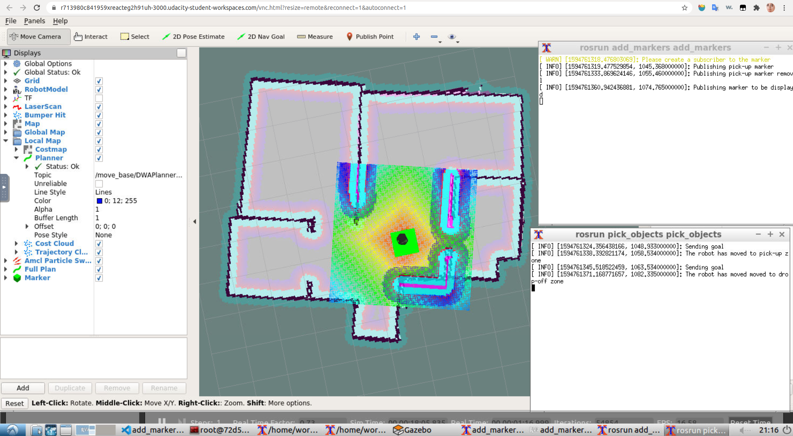
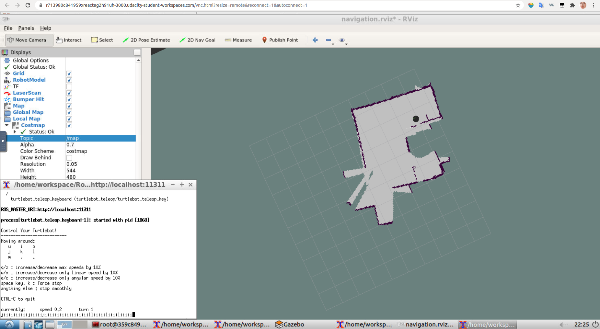
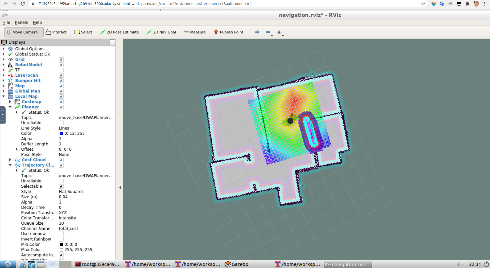

# Udacity Nanodegree: Robotics Software Engineer

## Project 05: Home Service Robot

<p align="center">
    Home Service Robot Rviz<br>
    
</p> 

### Directory Structure

```
.RoboND_HOME_SERVICE_ROBOT                 
├── src                                    
│   ├── scripts                            # scripts for launching 
│   │   ├── add_markers.sh                  
│   │   ├── home_service.sh                 
│   │   ├── pick_object.sh
│   │   ├── test_navigaton.sh               
│   │   └── test_slam.sh                    
│   ├── rvizConfig
│   │   └── add_markers.rviz               # Visualize markers in rviz
│   ├── map
│   │   └── ...                            # world and map files
│   ├── turtlebot    
│   │   ├── turtlebot_teleop               # turtlebot_teleop package
│   │   └── ...                            
│   ├── turtlebot_interactions   
│   │   ├── turtlebot_rviz_launchers       # turtlebot_rviz_launchers package 
│   │   └── ...                
│   ├── turtlebot_simulator  
│   │   ├── turtlebot_gazebo               # turtlebot_gazebo package 
│   │   └── ...     
│   ├── slam_gmapping  
│   │   ├── gmapping                       # gmapping package 
│   │   └── ...                                         
│   ├── pick_objects  
│   │   └── ...                            # generate pick_objects node
│   └── add_markers                         
│       └── ...                            # generate add_markers node 
└── ...
```

### Catkin Workspace setup

1. Update our system: sudo apt-get update && sudo apt-get upgrade.
2. Git clone this repo using git clone --recursive because this repo has 4 submodules: [turtlebot](http://wiki.ros.org/turtlebot?distro=kinetic), [turtlebot_interactions](http://wiki.ros.org/turtlebot_interactions?distro=kinetic), [turtlebot_simulator](http://wiki.ros.org/turtlebot_simulator?distro=kinetic), and [slam_gmapping](http://wiki.ros.org/gmapping).
3. Use rosdep to install dependencies for those packages.
4. Run catkin_make, if you see messages saying "rospkg not found", then you should run **pip install rospkg** before running catkin_make.
5. Get execution permisssion for all the shell scripts in the [scripts](./scripts).

### SLAM Testing

* Run test_slam.sh, then choose the xterminal running the keyboard_teleopnode, move the robot with keyboards. Utilizing gmapping can generate a map for us. If you want to save the map. You can type the following in the terminal:

``` terminal
rosrun map_server map_saver -f [name_of_your_map]
```

<p align="center">
    Test Slam Rviz<br>
    
</p> 

### Navigation Testing

* Run test_navigation.sh, utilize adaptive Monte Carlo localization to navigate our robot using the map generated by gmapping. In the Rviz window, we can let our robot go to the goal location we choose.

<p align="center">
    Test Slam Rviz<br>
    
</p> 

### Pick Objects

* Run pick_objects.sh, I sent different goals to the MoveBaseClient in order to move the robot around. When the robot reaches the first goal, it will wait for 5 seconds then go to the second goal.

### Add Markers

* Run add_markers.sh, it's quite alike the Pick Objects, I sent different visualization_msgs::Marker to the Rviz, and then we can visualize the markers. 

### Home Service Robot

* Run home_service.sh.
* In the codes, I use subscriber subsribed to the **amcl_pose** to consecutively check if the robot reaches the markers. **odom** coordinate is drifted away from the map coordinte when I look into the tf in Rviz, so I use **amcl_pose** for more precise result.
* When the robot reaches the pick-up zone, then the marker in pick-up zone will disappear, and when the robot reach drop-off zone, then a new marker will appear in the drop-off zone.

<p align="center">
    Home Service Robot Rviz<br>
    
</p> 

